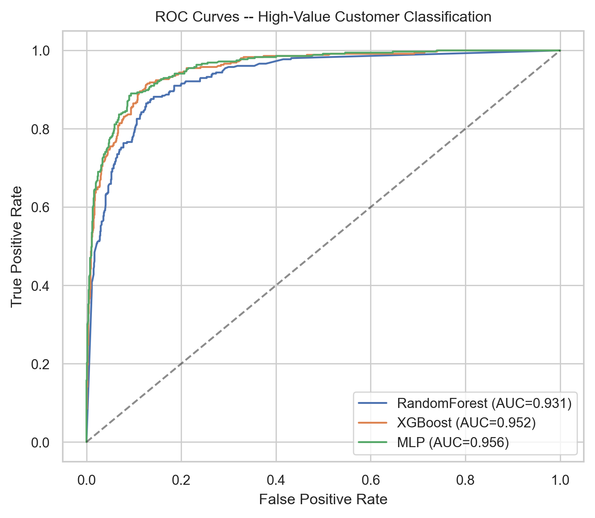
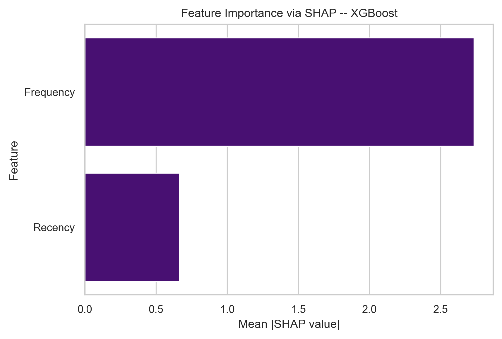
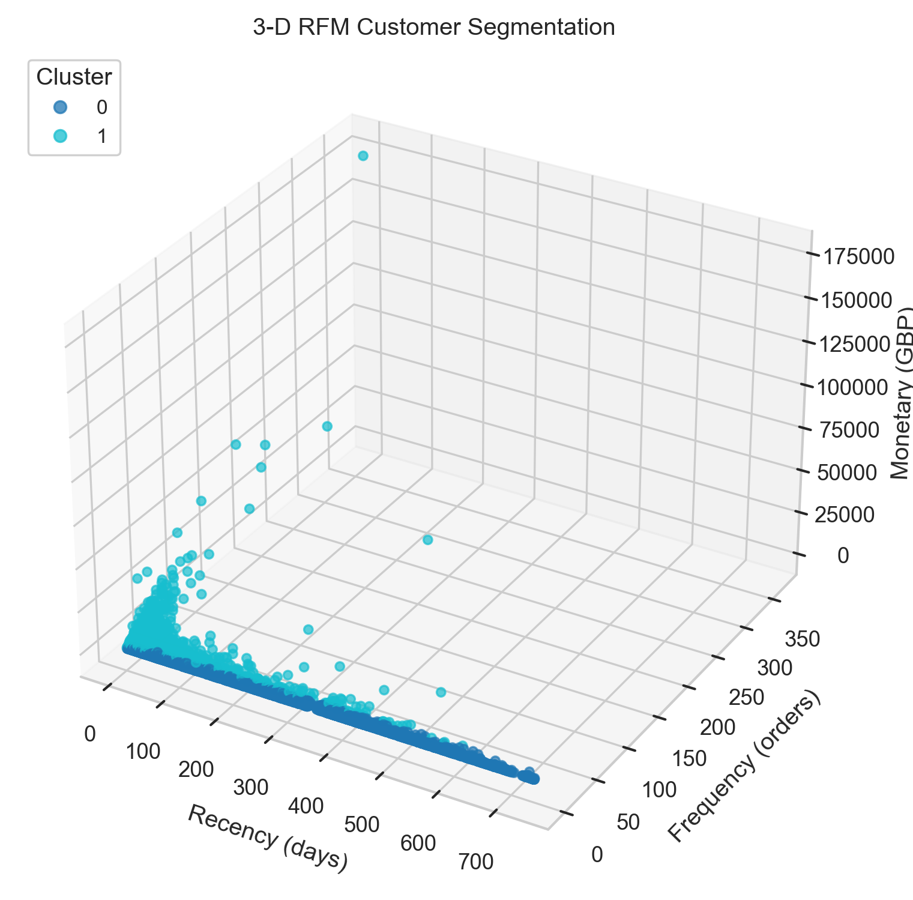

# Customer Segmentation & High-Value Spender Prediction

An ML pipeline on the UCI Online Retail II dataset (~1M transactions, 2009–2011) that segments customers using their RFM behaviour and predicts which ones are likely to be top-quartile spenders.

Built as the term project for **ED317 – Statistical Machine Learning I** at the Centre of Quantitative Economics and Data Science, BIT Mesra.

---

## Pipeline

1. **Preprocessing** — clean cancellations, missing CustomerIDs, duplicates; IQR outlier removal on Quantity and UnitPrice; engineer per-customer **R**ecency / **F**requency / **M**onetary features; log1p + StandardScaler for the modelling matrix.
2. **Unsupervised segmentation** — K-Means, DBSCAN, Gaussian Mixture, and a PyTorch **autoencoder + K-Means** deep-clustering model (3→16→8→4→8→16→3, 50 epochs).
3. **Supervised classification** — predict whether a customer is in the top 25% of monetary spenders. Random Forest, XGBoost, and an MLP, all trained with **SMOTE** on the imbalanced training fold and scored with **5-fold stratified CV**.
4. **Explainability** — SHAP TreeExplainer on the best tree model.

All experiments are seeded (`SEED=42`) and reproducible end-to-end with `python main.py`.

---

## Results

### Clustering (5,675 customers, 2-cluster solution)

| Algorithm                | Silhouette ↑ | Davies-Bouldin ↓ | Calinski-Harabasz ↑ |
|--------------------------|:---:|:---:|:---:|
| K-Means                  | 0.437 | 0.873 | 6,018 |
| DBSCAN                   | — (collapsed) | — | — |
| Gaussian Mixture         | 0.309 | 0.977 | 3,232 |
| **Autoencoder + KMeans** | **0.574** | **0.622** | **11,748** |

The autoencoder learns a 4-D latent code that separates customers far more cleanly than RFM space directly. The two natural segments are **Champions** (n=2,267, recent + frequent + high-spend) and **Loyal-but-lapsing** (n=3,408, ~300 days since last purchase).

### Classification (high-value vs. rest, 75/25 split, test set)

| Model           | Accuracy | Precision | Recall | F1 | ROC-AUC | CV F1 (μ ± σ) |
|-----------------|:---:|:---:|:---:|:---:|:---:|:---:|
| Random Forest   | 0.875 | 0.720 | 0.817 | 0.765 | 0.931 | 0.891 ± 0.005 |
| **XGBoost**     | **0.885** | 0.715 | 0.899 | **0.797** | 0.952 | 0.894 ± 0.009 |
| MLP             | 0.865 | 0.665 | 0.924 | 0.774 | **0.956** | 0.876 ± 0.006 |

XGBoost wins on F1; the MLP edges it slightly on ROC-AUC. All three models exceed AUC 0.93, which means Recency and Frequency alone are already very informative about who the big spenders are (Monetary is held out to avoid label leakage).

### SHAP attribution (best XGBoost model)

| Feature   | mean \|SHAP\| |
|-----------|:---:|
| Frequency | 2.73 |
| Recency   | 0.66 |

Purchase frequency is by far the dominant signal — repeat-buyers drive revenue more than recent-buyers do.

---

## A few of the figures

ROC curves across all three classifiers:



SHAP feature importance for the XGBoost model:



3-D RFM scatter coloured by the K-Means segment assignment:



(The full set of 9 figures is in `outputs/figures/`.)

---

## Tech stack

`Python 3.11` · `pandas` · `numpy` · `scikit-learn` · `XGBoost` · `PyTorch` · `imbalanced-learn` · `SHAP` · `matplotlib`

---

## Project layout

```
sml_project/
├── data/                    # UCI dataset auto-downloads here on first run
├── src/
│   ├── preprocess.py        # cleaning + RFM feature engineering
│   ├── clustering.py        # K-Means, DBSCAN, GMM, AE+KMeans
│   ├── classification.py    # RF, XGBoost, MLP with SMOTE + 5-fold CV
│   ├── evaluation.py        # metric tables + SHAP
│   ├── visualisation.py     # all figures
│   └── utils.py
├── outputs/
│   ├── figures/             # 9 PNGs (≥250 dpi)
│   └── tables/              # 9 CSVs
├── main.py
├── requirements.txt
└── README.md
```

---

## How to run

```bash
pip install -r requirements.txt
python main.py
```

The script downloads `online_retail_II.xlsx` into `data/` on first run (~45 MB), then runs the full pipeline and writes all artefacts to `outputs/`. Takes ~3–5 minutes on a laptop.

---

## Author

**Shreya Mishra** &nbsp;·&nbsp; IED/10032/23
Centre of Quantitative Economics and Data Science, BIT Mesra
shreyamishra.iedce23@bitmesra.ac.in

Submitted to: Dr. Manish Kumar Pandey
